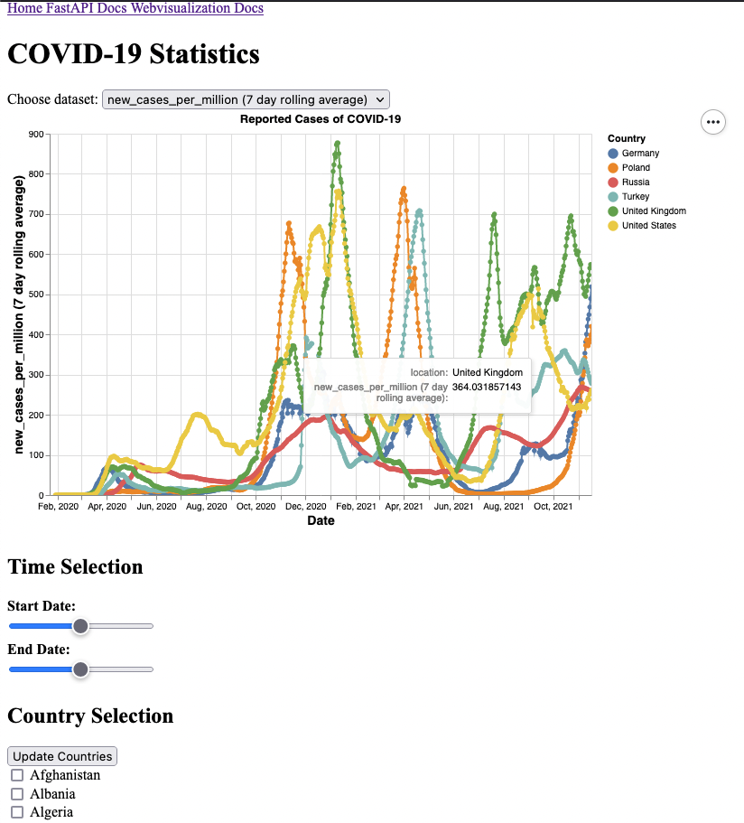

# Assignment 6: Web Programming and Data Analysis
## Dependencies 
The dependencies to run all the programs in this project may be installed using pip 
```bash
pip install sphinx altair altair_viewer pandas fastapi uvicorn
```

## Running the webapp
The webapp may be started by running
```bash
uvicorn webapp:app
```
the app may then be viewed in a browser at the address specified by uvicorn in the terminal, `http://127.0.0.1:8000`by default.

## Preview of the webpage


## Overview of the assignment:
Here are some notes that aim to make it easy to get an overview of what i have done/havent done in this assignment, and where you can find it. 
### 6.1
The "default" figure may be displayed without opening the webpage by running `python3 webvisualization_plots.py`. Note that this requires the package `altair_viewer`to be installed.
### 6.2
Implemented in `python3 webvisualization_plots.py` and `python3 webapp.py`. The webpage may be started by running
```bash
uvicorn webapp:app
```
and then  opening `http://127.0.0.1:8000` in your favourite browser.
### 6.3
Countries may be specified using checkboxes towards the bottom of the page, but time range has not been made adjustable (the sliders on the webpage don't currently do anything).
### 6.4 (IN4110)
The 7-day rolling window is computed within ```get_data_from_csv()``` and added to the outgoing dataframe. This may then be displayed by selecting "new_cases_per_million (7 day rolling average)" in the "Choose dataset" drop-down menu. I also added a few other interesting datasets to the menu, and adding more is a trivial task due to how i programmed it.
### 6.5
Sphinx documentation for `webvisualization_plots.py` may be accessed by clicking the link at the top of the page. 
The docs page is built by running
```
make html
```
in `/docs` and may be opened outside of the webapp by `open docs/_build/html/index.html`
## 6.6 (Bonus)
The tooltip is added in `plot_reported_cases_per_million` to display the country and y-value. Adding the cumulative cases is done by utilizing what i did in 6.4 and simply adding the "total_cases" column to the returned dataframe.
## 6.7 (Bonus)